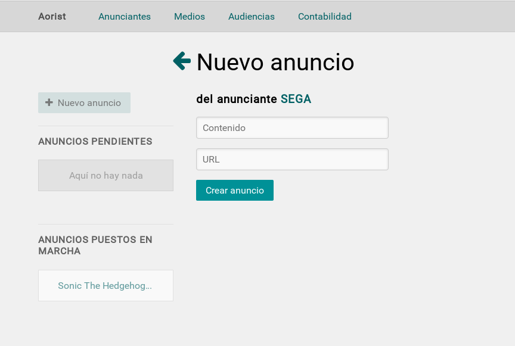

# Introducción
Aorist (Ad Oriented Information System) es un sistema de gestión dirigido a empresas de publicidad, principalmente orientado a la publicidad online. El sistema modela las empresas anunciantes y los medios de forma que se puedan relacionar mediante los anuncios de las primeras y los espacios publicitarios de los segundos. Además, se facilita la segmentación del mercado y la asociación entre anunciantes y medios con audiencias afines.

## Áreas funcionales

* Gestión de anunciantes:
Permite dar de alta empresas que quieran promocionar sus productos, relacionarlas con tipos de audiencia y la creación de contratos con dichas empresas.

* Gestión de medios:
Permite dar de alta y gestionar los medios donde se visualizarán los anuncios, por ejemplo: sitios web, aplicaciones móviles, revistas... Cada medio puede ir relacionado con ciertos tipos de audiencia y se pueden crear contratos asociados.

* Anuncios y espacios:
Incluye la creación de distintos tipos de espacios que después se podrán ocupar mediante anuncios asociados a los anunciantes.

* Transacciones económicas:
Permite tramitar los cobros a las empresas anunciantes, y los pagos a los medios.

* Audiencia:
Administra los distintos perfiles de visitantes que se ofertan a los anunciantes y en función de los cuáles se distribuyen los anuncios a los medios.

# Instalación

Esta es una guía para instalar Aorist en un sistema operativo con kernel Linux, creada y seguida desde Ubuntu 14.04.

## Dependencias previas

Necesitaremos paquetes para la gestión de la base de datos y un intérprete de JavaScript. Para la base de datos, instalamos *sqlite3*, mientras que como intérprete de JavaScript usaremos *nodejs*. Podemos instalarlos con los comandos:

~~~sh
sudo apt-get install sqlite3
sudo apt-get install nodejs
~~~

## Instalación de Ruby

En caso de que no tengamos Ruby instalado en nuestro sistema, es necesario realizar esta instalación. Lo haremos instalando previamente RVM (*Ruby Version Manager*), que nos permitirá usar Ruby con mayor comodidad. Para instalar RVM y Ruby ejecutaremos los siguientes comandos:

~~~sh
gpg --keyserver hkp://keys.gnupg.net --recv-keys\
  409B6B1796C275462A1703113804BB82D39DC0E3
\curl -sSL https://get.rvm.io | bash -s stable --ruby
~~~

En este punto ya tendremos instalado RVM con Ruby. Seguidamente,  ejecutamos el comando `source /home/usuario/.rvm/scripts/rvm` para poder usar rvm. Cambiaremos de versión de Ruby a la 2.2.1 con el comando `rvm use 2.2.1`.

## Instalación de las gemas y migración de la base de datos

Ya tenemos instalado Ruby. Ahora tenemos que instalar las gemas necesarias. Para empezar, instalamos bundler con `gem install bundler`, lo que nos permitirá intalar el resto de gemas.

Una vez instalado, en la carpeta de la aplicación ejecutamos `bundle --without=test` para instalar todas las gemas necesarias para Aorist.

Instaladas las gemas, hemos de migrar la base de datos. Para ello, ejecutamos `rake db:migrate`. Una vez hecho esto, la aplicación está lista para usarse. Solo queda lanzar el servidor con el comando `rails server`.

# Implementación

<!--
Usamos MVC. Modelo: Migraciones. Rails genera la BBDD. Vista: Escrito en haml. Controladores: En Ruby.
Cómo divide Rails los archivos.

-->

# Uso de Aorist

Vamos a detallar el uso de cada parte de Aorist.

<!--
Pantalla de inicio. Hablar de las opciones. Creación y destrucción de datos.
-->

## Gestión de anunciantes

<!--
Algunas imágenes pendientes de incluir. Se modelará para que las menos relevantes estén unidas y no ocupen demasiado espacio.
-->

Al acceder al menú de Gestión de anunciantes, nos encontramos una pantalla con el listado de los anunciantes almacenados en el sistema, junto a la opción de crear un nuevo anunciante. Podemos verlo en la Figura 1.

Si accedemos al menú de creación de un nuevo anunciante, nos encontramos un formulario para rellenar los datos del nuevo anunciante: el nombre, la web y los datos fiscales. Además, a la izquierda podemos ver los anunciantes ya creados en el sistema, y podemos acceder a ellos pinchando en su recuadro. Esto puede ser visto en la Figura 2.

Si hacemos click en cualquier anunciante, accedemos a su ficha. En ella vemos todos sus datos y tenemos enlaces para ver sus anuncios, sus contratos y eliminar el anunciante, además de la lista de audiencias que tiene asociadas y las que no. Es posible asociarle una nueva audiencia con la opción que aparece al lado de cada una de las que no tiene asociadas.

Para acceder a los detalles de sus anuncios y contratos deberemos hacer click en la opción correspondiente. Podemos ver la ficha completa en la Figura 3.

Si accedemos a los anuncios de nuestro anunciante, se mostrarán dos listados: aquellos anuncios que están puestos en marcha (es decir, ya tengan un espacio asociado) y aquellos que no lo estén. Además, tendremos la opción de crear un nuevo anuncio asociado al anunciante, especificando su contenido y su URL, en caso de tenerla. De nuevo tendremos un listado de los anuncios ya existentes a la izquierda, como teníamos en los anunciantes.

En la ficha de cada anuncio tenemos sus datos y las opciones de editar dichos datos, lo que nos lleva a un formulario similar al de creación de un nuevo anuncio, y eliminarlo completamente del sistema. Además, podemos ver un listado de los espacios que tiene asociados (en caso de tener alguno) y de aquellos que no pero es posible establecer dicha asociación, con la posibilidad de realizarla. En estos espacios también se muestra el número de audiencias en común entre el anunciante y el medio, criterio a tener en cuenta a la hora de asociar el anuncio a algún espacio. Podemos verlo de forma detallada en la siguiente Figura.

Entrando ahora en los contratos de cada anunciante, nos encontramos de nuevo un listado con los contratos creados, con la posibilidad de acceder a un menú para crear uno nuevo proporcionando sus datos. Dentro de la ficha de cada contrato nos encontramos con todos sus datos, junto a sus cobros asociados y la posibilidad de registrar uno nuevo. Para ello simplemente especificaremos la fecha y el importe del cobro. Podemos ver estos menús en la Figura.

## Gestión de medios

El menú de Gestion de medios es similar al de Gestión de anunciantes. Inicialmente, nos encontramos un listado de todos los medios y la posibilidad de crear uno nuevo, accediendo a una pantalla donde especificar su nombre, web y datos fiscales. Dentro de la ficha de cada medio encontraremos sus datos, un enlace a sus contratos y a sus espacios, sus audiencias asociadas y las no asociadas (con la posibilidad de asociarle nuevas), y una opción de eliminar el medio del sistema. Podemos ver todo esto en las siguientes Figuras.

Si nos vamos a los espacios asociados a cada medio, encontramos un listado de los ya creados. Accediendo a cualquiera de ellos podemos ver sus datos y tenemos la posibilidad de eliminarlo del sistema. Al contrario que en los anuncios, los datos de los espacios no pueden ser editados, por tanto no nos encontraremos dicha opción.

Para los contratos asociados a un medio, nos econtraremos la misma funcionalidad que en los asociados a los anunciantes: tendremos un listado de los contratos, la posibilidad de crear uno nuevo, y en su ficha podremos visualizar sus datos y crear un nuevo pago asociado a dicho contrato. Podemos ver esto en la siguiente Figura.

## Gestión de audiencias

## Contabilidad
